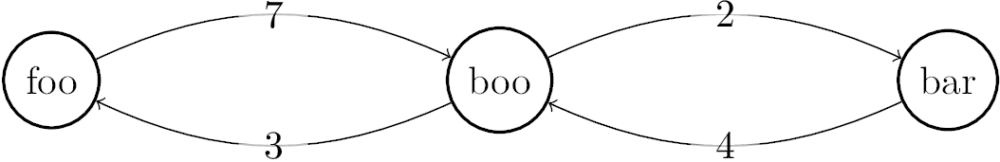

[](https://classroom.github.com/a/NehM89hy)
# Augmenting Paths

When we talked about the Ford-Fulkerson algorithm to find the maximum flow
through a graph, I mentioned the "find an augmenting path" function. You're
going to implement this function. Start with the template I provided in
`code.js`. Use an adjacency list data structure to represent the graph and node
names, not indices, to indicate start and end node. The function returns a list
of node names, starting with the start node and finishing with the end node. If
start and end node are the same, it should return a list containing only this
node. If there is no path, you must return an empty list.

Test your new function; I've provided some basic testing code in `code.test.js`.

To illustrate, here's an example graph:


Here's the call for this graph:

```javascript
var graph = {'foo': {'boo': 7},
             'boo': {'foo': 3, 'bar': 2},
             'bar': {'boo': 4}};
augmentingPath(graph, 'foo', 'bar');
```

The call would return `['foo', 'boo', 'bar']`.

Feel free to use other data structures, but you'll have to change the test code
accordingly.

## Runtime Analysis

What is the worst-case big $\Theta$ complexity of your implementation? Add your
answer, including your reasoning, to this markdown file.


# Runtime Analysis of the Augmenting Path Implementation

To figure out the worst-case time complexity for the augmentingPath function that uses Depth-First Search (DFS) to look through a graph, we can think about how the graph is set up and how DFS works:

## Algorithm Steps:

- **Depth-First Search**: The algorithm performs a DFS on the graph, beginning from the $start$ node and exploring until it reaches the $end$ node or finds no path.
- **Visiting Nodes**: In the worst case, DFS could visit all vertices and explore all edges in the graph before finding a path or coming to the conclusion that no path exists.
- **Adjacency List Representation**: Since the graph is represented by an adjacency list, the exploration of each node's neighbors is quite efficient, directly related to the node's degree (# of eges connected to it).
- **Revisiting Nodes**: The algorithm ensures that no node is visited more than once by using a $visited$ set.

## Worst-Case Scenario Analysis:

The worst-case scenario would occur when the algorithm must explore every edge from each node before finding the augmenting path or determining there is none. For a graph with $V$ vertices and $E$ edges:

- **DFS Exploration**: Traversing all vertices in the graph results in a complexity of $O(V)$, as each vertex is visited once.
- **Edge Exploration**: In the process of visiting vertices, every edge connected to every vertex will be explored once, giving us another term of $O(E)$ for exploring all edges.

Combining these two aspects, the time complexity in the worst case for the $augmentingPath$ function is the sum of the complexities for visiting every vertex and exploring every edge.

## Conclusion:

The overall worst case time complexity of the $augmentingPath$ function, which uses DFS to find an augmenting path in a flow network, is $O(V + E)$, because it may potentially explore every vertex and edge in the search for an augmenting path.

When expressed using big theta notation, the precise bound on the runtime is $$\Theta(V + E)\$$ Thus showing that the algorithm is linearly proportional to the number of vertices and edges in the graph in the worst-case scenario.

